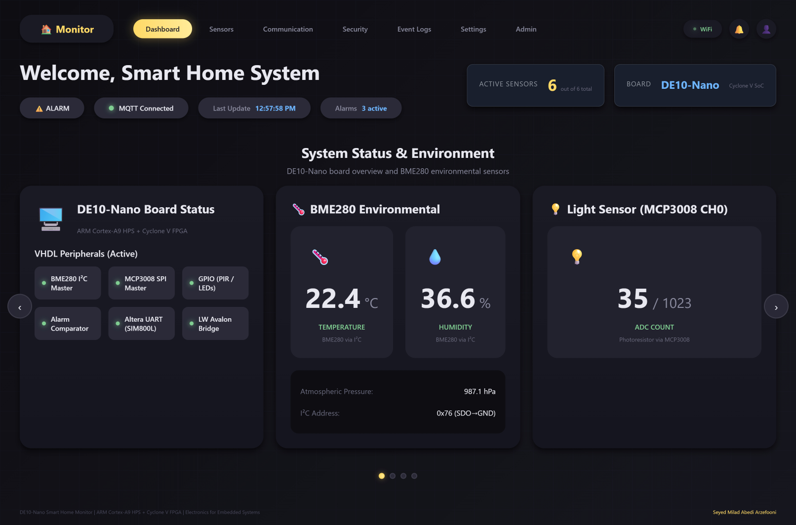
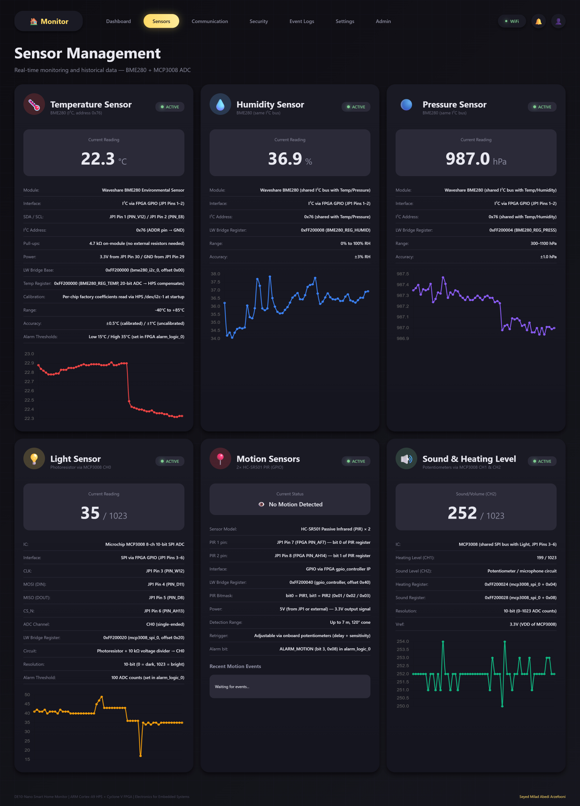

# 🌐 Smart Home Monitor — Web Dashboard

Part of the **IoT Smart Home Monitor** project built on a DE10-Nano (Intel Cyclone V SoC) for the *Electronics for Embedded Systems* course at Politecnico di Torino (A.Y. 2025–2026).


<br>

<br>

This component is a Python Flask web application that subscribes to the MQTT broker, stores historical sensor data in SQLite, and serves a real-time browser dashboard with role-based user management.

---

## 📋 Table of Contents

- [Features](#features)
- [Architecture](#architecture)
- [File Descriptions](#file-descriptions)
- [Configuration](#configuration)
- [Setup & Run](#setup--run)
- [User Roles & Authentication](#user-roles--authentication)
- [MQTT Topics](#mqtt-topics)
- [Production Deployment](#production-deployment)

---

## ✨ Features

- 📊 **Real-time sensor data** pushed to browsers via WebSocket (Flask-SocketIO)
- 🚨 **Alarm notifications** with severity classification (warning / critical)
- 🗄️ **Historical data** stored in SQLite with per-session analytics
- 🔐 **Role-based access control**: superadmin, admin, user
- 🛠️ **Admin panel**: user management, permission control, activity audit log
- 🔁 **MQTT auto-reconnect** with exponential backoff (5–60 second intervals)
- ⚙️ **Threshold configuration** stored in DB, tunable from the dashboard

---

## 🏗️ Architecture

```
📡 MQTT Broker (Mosquitto)
        │
        ▼
  mqtt_handler.py  ──► 🗄️ SQLite (SensorData, AlarmEvent)
        │
        ▼
  app_with_auth.py (Flask + SocketIO)
        │  WebSocket events: sensor_update, alarm_update, mqtt_status
        ▼
  🖥️ Browser Dashboard
```

---

## 📁 File Descriptions

| File | Purpose |
|------|---------|
| `app_with_auth.py` | 🏠 Flask application factory: registers routes, initialises SocketIO, starts MQTT handler |
| `auth_routes.py` | 🔐 Login, logout, session management, password handling |
| `admin_routes.py` | 🛠️ Admin-only endpoints: user CRUD, role assignment, activity log viewer |
| `admin_models.py` | 👤 SQLAlchemy models: `User`, `UserSession`, `ActivityLog` |
| `models.py` | 📊 SQLAlchemy models: `SensorData`, `AlarmEvent`, `ControlSettings`, `SystemStatus` |
| `mqtt_handler.py` | 📡 Paho-MQTT client: subscribes to broker, parses JSON, emits SocketIO events, persists to DB |
| `mqtt_broker.py` | 🔧 Optional helper to start a local Mosquitto instance for development |
| `init_admin.py` | 🚀 One-time bootstrap: creates DB tables and default superadmin account |
| `wsgi.py` | 🖥️ Gunicorn entry point for production |
| `requirements.txt` | 📦 Python package dependencies |
| `templates/` | 🎨 Jinja2 HTML templates |
| `static/` | 🖼️ CSS, JavaScript, images |

---

## ⚙️ Configuration

Create a `.env` file in the `panel/` directory (never commit this file):

```env
# 🔒 Flask
FLASK_SECRET_KEY=change-this-to-a-random-secret
FLASK_HOST=0.0.0.0
FLASK_PORT=5000

# 🗄️ Database
DATABASE_URI=sqlite:///smarthome.db

# 📡 MQTT Broker (must match smart_home.h in C supervisor)
MQTT_BROKER_HOST=YOUR_BROKER_IP_OR_HOST
MQTT_BROKER_PORT=1883
MQTT_USERNAME=YOUR_MQTT_USER
MQTT_PASSWORD=YOUR_MQTT_PASS
MQTT_TOPIC_SENSORS=smarthome/sensors
MQTT_TOPIC_ALARMS=smarthome/alarms
```

---

## 🚀 Setup & Run

### Prerequisites

- Python 3.10+
- A running Mosquitto (or compatible) MQTT broker reachable at the configured host/port

### 📦 Install

```bash
cd panel/
python3 -m venv venv
source venv/bin/activate          # Windows: venv\Scripts\activate
pip install -r requirements.txt
```

### 🗄️ Initialise the Database

```bash
python init_admin.py
```

This creates `smarthome.db` and a default superadmin account:

| Username | Password |
|----------|----------|
| `admin`  | `admin123` |

> ⚠️ **Change the default password immediately after first login!**

### ▶️ Development Server

```bash
python app_with_auth.py
```

Open `http://localhost:5000` in your browser.

---

## 🔐 User Roles & Authentication

| Role | Capabilities |
|------|-------------|
| 👑 **superadmin** | Full access: user management, role assignment, all data, system config |
| 🛠️ **admin** | View all sensor data, manage alarm settings, view activity log |
| 👤 **user** | View real-time dashboard and historical data only |

All passwords are stored as hashed values (Werkzeug `generate_password_hash`). Sessions expire on browser close unless "remember me" is selected.

---

## 📡 MQTT Topics

The panel subscribes to two topics:

### `smarthome/sensors` (published every 5 s by C supervisor)

```json
{
  "temperature": 23.45,
  "pressure": 1012.3,
  "humidity": 55.2,
  "light": 512,
  "heating": 256,
  "sound": 128,
  "pir1": 0,
  "pir2": 1,
  "alarms": 0
}
```

### `smarthome/alarms` (published on alarm event)

```json
{
  "alarm_flags": 4,
  "description": "MOTION_DETECTED"
}
```

**🚨 Alarm flag bitmask:**

| Bit | Flag | Description |
|-----|------|-------------|
| 0 | `TEMP_HIGH` | 🌡️ Temperature above upper threshold |
| 1 | `TEMP_LOW` | 🥶 Temperature below lower threshold |
| 2 | `LIGHT_LOW` | 🌑 Light level below threshold |
| 3 | `MOTION` | 🚶 PIR motion detected |
| 4 | `CRITICAL` | 🔴 Multiple simultaneous alarms |

---

## 🖥️ Production Deployment

Use Gunicorn with threading worker class (required for SocketIO):

```bash
gunicorn --worker-class=gthread --workers=4 --bind 0.0.0.0:5000 wsgi:app
```

For a public-facing deployment, place Nginx as a reverse proxy in front of Gunicorn and enable HTTPS:

```nginx
server {
    listen 80;
    server_name your-domain.com;

    location / {
        proxy_pass http://127.0.0.1:5000;
        proxy_http_version 1.1;
        proxy_set_header Upgrade $http_upgrade;
        proxy_set_header Connection "upgrade";
        proxy_set_header Host $host;
    }
}
```

---

## 📦 Dependencies

See `requirements.txt`. Key packages:

| Package | Purpose |
|---------|---------|
| `flask` | 🌐 Web framework |
| `flask-socketio` | ⚡ WebSocket real-time events |
| `flask-sqlalchemy` | 🗄️ ORM for SQLite |
| `flask-login` | 🔐 Session management |
| `paho-mqtt` | 📡 MQTT client |
| `python-dotenv` | ⚙️ `.env` configuration loading |
| `gunicorn` | 🖥️ Production WSGI server |
